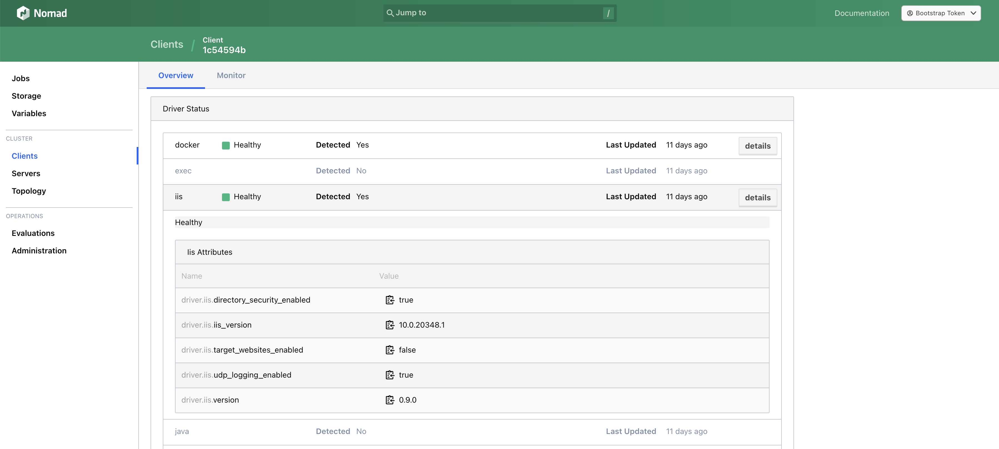

# Installation

## Requirements

Running *Nomad IIS* has the following system requirements:

- Windows Server 2016+
  - Using Windows 10 also works but is not recommended in production.
- IIS 10
- Up to date Nomad Cluster

:::info
Currently i only test against the latest versions of Nomad, although older versions down to 1.6 might work.
:::

:::tip
Install Windows Server Core without the Desktop Experience to save RAM.
:::

## Install Windows IIS

You can use the following Powershell script to install IIS on your machine.

```ps1
$features = @(
    "IIS-WebServerRole",
    "IIS-WebServer",
    "IIS-CommonHttpFeatures",
    "IIS-HttpErrors",
    "IIS-HttpRedirect",
    "IIS-ApplicationDevelopment",
    "NetFx4Extended-ASPNET45",
    "IIS-NetFxExtensibility45",
    "IIS-HealthAndDiagnostics",
    "IIS-HttpLogging",
    "IIS-LoggingLibraries",
    "IIS-RequestMonitor",
    "IIS-HttpTracing",
    "IIS-Security",
    "IIS-RequestFiltering",
    "IIS-Performance",
    "IIS-WebServerManagementTools",
    "IIS-IIS6ManagementCompatibility",
    "IIS-Metabase",
    "IIS-ManagementConsole",
    "IIS-BasicAuthentication",
    "IIS-WindowsAuthentication",
    "IIS-StaticContent",
    "IIS-DefaultDocument",
    "IIS-WebSockets",
    "IIS-ApplicationInit",
    "IIS-ISAPIExtensions",
    "IIS-ISAPIFilter",
    "IIS-HttpCompressionStatic",
    "IIS-ASP",
    "IIS-ServerSideIncludes",
    "IIS-ASPNET45"
)

Enable-WindowsOptionalFeature -Online -FeatureName $features
```

By default, Windows will setup a default Website and some Application Pools when installing IIS. If you don't need them, you can remove them by running:

```ps1
Remove-IISSite -Name "Default Web Site"
Remove-WebAppPool -Name ".NET v4.5"
Remove-WebAppPool -Name ".NET v4.5 Classic"
Remove-WebAppPool -Name "DefaultAppPool"
```

Enable feature delegation for *Anonymous Authentication* in the host configuration of IIS by running:

```ps1
Set-WebConfiguration //System.WebServer/Security/Authentication/anonymousAuthentication -metadata overrideMode -value Allow
```

:::note
This is not needed for Nomad-IIS to run, but may be required by some workloads like our sample application.
:::

## Setup Windows Firewall

Nomad client will dynamically allocate ports on your machine in the range 20000-32000.
Therefore we need to open these ports on the Windows Firewall by running:

```ps1
New-NetFirewallRule -DisplayName "Allow Nomad Dynamic Ports 20000-32000" -Action Allow -Direction Inbound -Protocol TCP -LocalPort 20000-32000
```

## Nomad Client Installation

Follow the official tutorials from HashiCorp to install a Nomad Client on your Windows Server.

https://developer.hashicorp.com/nomad/tutorials/windows

:::tip
I suggest to use [*HashiCorp Packer*](https://www.packer.io/) for automating the provisioning of client nodes if you need to maintain a lot of nodes.
I'll provide an example as soon as i have time.
:::

## Download Nomad IIS

Download the latest version of the Nomad-IIS plugin from the Releases page at GitHub.

[Download](https://github.com/sevensolutions/nomad-iis/releases)

Extract the ZIP-file and copy the *nomad_iis.exe* into your configured plugin directory.

## Configure Nomad IIS

Add the following snippet to your Nomad client configuration file and restart the client.

```hcl
plugin "nomad_iis" {
  config {
    enabled = true
  }
}
```

After you've restarted the client, open the UI of your Nomad cluster and navigate to the client.
The IIS driver should now be healthy and report some version stats.


